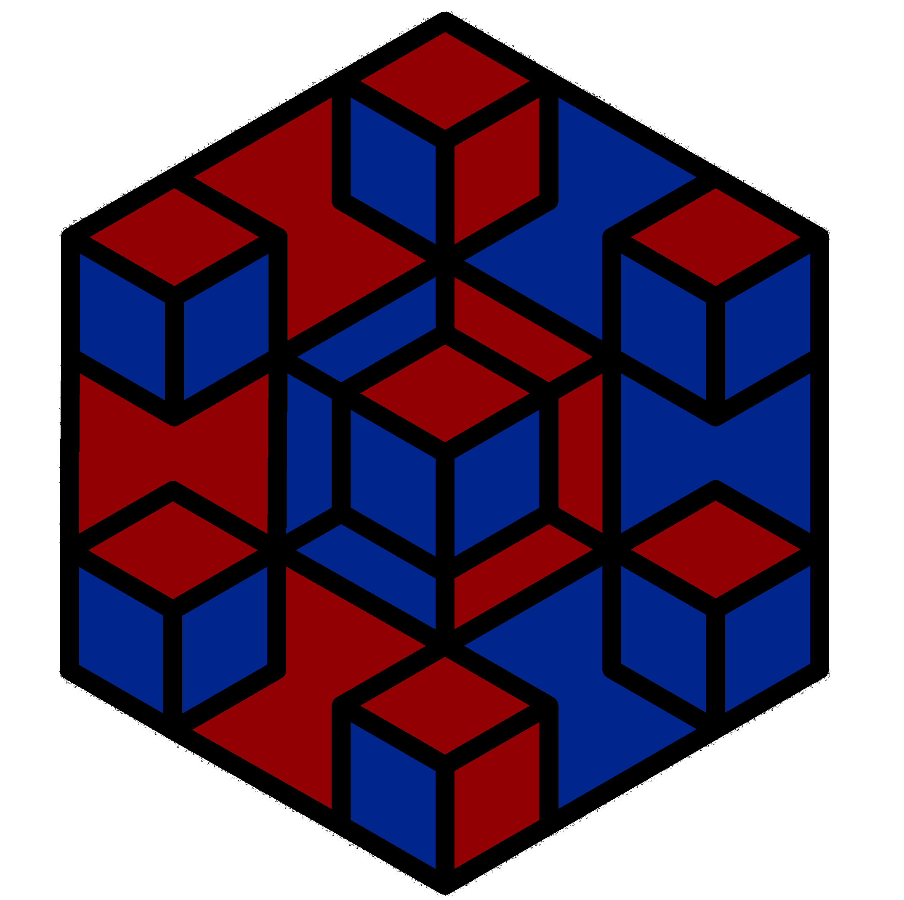

# Blacketch

 Blacketch is a simple blockchain implementation written by Racket. 

# Why this project?
I've always been curious about what people are talking about when they talk about blockchain, and when I was puzzled, it occurred to me why I didn't implement a blockchain system myself to get a deeper understanding of the field.

__NOTE: This project is just a learning project__

# How to use?

- Built on Racket 8.5

## Dependencies
- crypto : `raco pkg install crypto`
- sha : `raco pkg install sha`

You can specify the mining difficulty by setting the value of `difficulty` in `src/block.rkt`.

- `racket main.rkt` or `raco exe main.rkt && ./main`
- `racket main-p2p.rkt` or `raco exe main-p2p.rkt && ./main`

# Acknowledgements
- This project was inspired by:
    https://github.com/MarkP88/racket-coin

- The project's logo was inspired by
    1. https://www.vecteezy.com/vector-art/548262-cryptocurrency-and-blockchain-icons-or-logo

    2. https://racket-lang.org

# Others
- PRESS.one DSL script interpreter is written in Clojure : https://github.com/Press-One/prsc

- A blockchain implementation in Go, as described in these articles: https://github.com/Jeiwan/blockchain_go

- Introducing Blockchain with Lisp: https://leanpub.com/ibl

# License
Copyright (c) 2022 Muqiu Han

Permission is hereby granted, free of charge, to any person obtaining a copy
of this software and associated documentation files (the "Software"), to deal
in the Software without restriction, including without limitation the rights
to use, copy, modify, merge, publish, distribute, sublicense, and/or sell
copies of the Software, and to permit persons to whom the Software is
furnished to do so, subject to the following conditions:

The above copyright notice and this permission notice shall be included in all
copies or substantial portions of the Software.

THE SOFTWARE IS PROVIDED "AS IS", WITHOUT WARRANTY OF ANY KIND, EXPRESS OR
IMPLIED, INCLUDING BUT NOT LIMITED TO THE WARRANTIES OF MERCHANTABILITY,
FITNESS FOR A PARTICULAR PURPOSE AND NONINFRINGEMENT. IN NO EVENT SHALL THE
AUTHORS OR COPYRIGHT HOLDERS BE LIABLE FOR ANY CLAIM, DAMAGES OR OTHER
LIABILITY, WHETHER IN AN ACTION OF CONTRACT, TORT OR OTHERWISE, ARISING FROM,
OUT OF OR IN CONNECTION WITH THE SOFTWARE OR THE USE OR OTHER DEALINGS IN THE
SOFTWARE.
